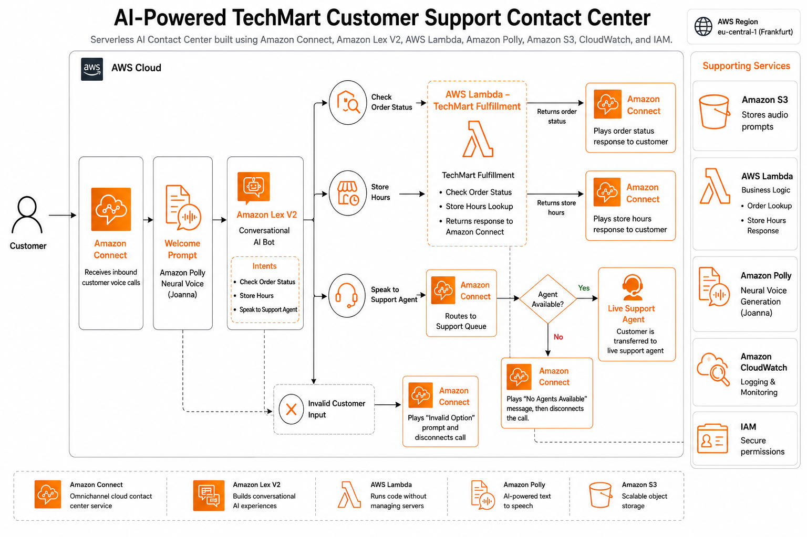
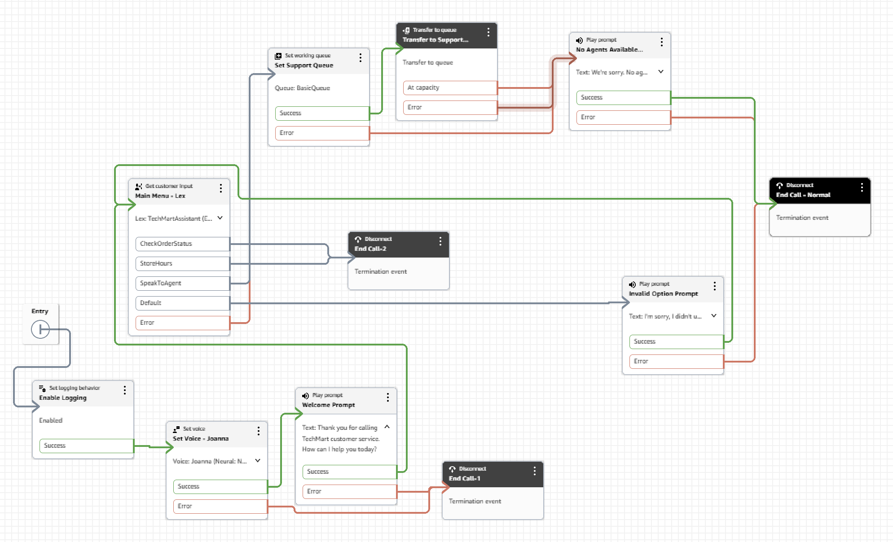
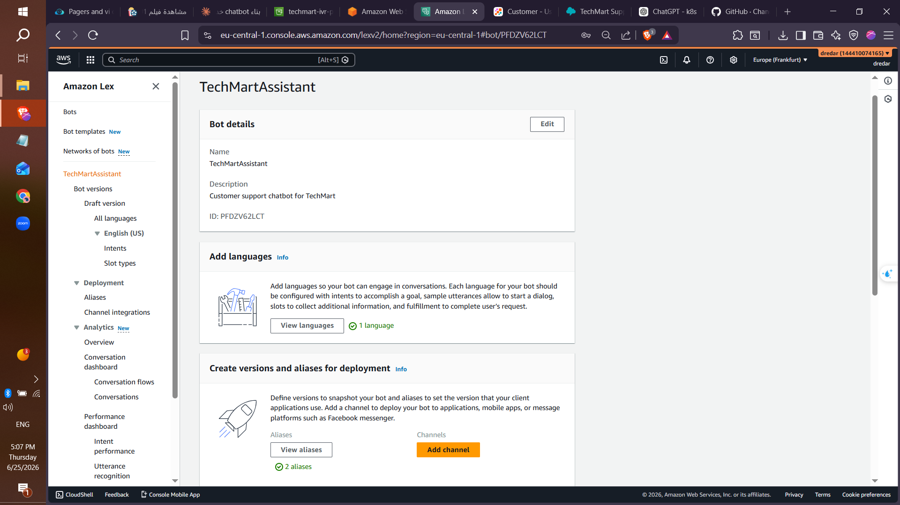
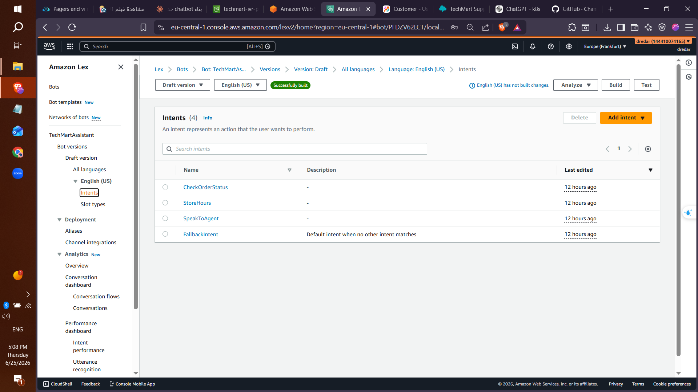
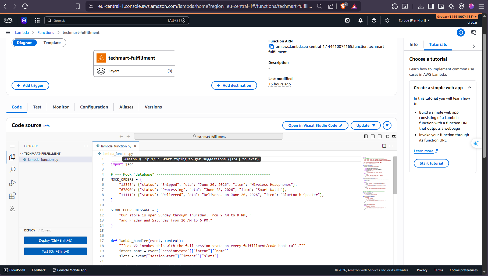

# Amazon Connect + Lex + AI Contact Center IVR

A sample AWS contact-center IVR solution built with Amazon Connect, Amazon Lex V2, AWS Lambda, and Amazon Polly. This repository demonstrates a lightweight, extensible architecture for voice-driven customer service interactions, including dynamic greetings and conversational order status fulfillment.

## Overview

This project implements a proof-of-concept Intelligent Voice Response (IVR) flow for a retail contact center. It uses:

- **Amazon Connect** for inbound voice channel and contact flows
- **Amazon Lex V2** for conversational intent handling
- **AWS Lambda** for custom fulfillment and dynamic prompt generation
- **Amazon Polly** to synthesize spoken greetings into MP3 prompts
- **Amazon S3** to store generated audio prompts

The solution supports:

- Order status lookups via Lex intent confirmation
- Store hours information
- Live agent handoff
- Time-of-day-aware greeting generation

## Architecture

The repository contains an architecture diagram showing the relationship between Amazon Connect, Amazon Lex, Lambda, Polly, and S3.

### Flow

1. Customer calls into Amazon Connect.
2. Connect invokes Amazon Lex V2 for speech understanding.
3. Lex routes to the appropriate intent.
4. AWS Lambda handles fulfillment or prompt generation.
5. Dynamic greetings are synthesized and stored in S3.
6. Responses are delivered back through the contact flow.

## Repository Structure

- `lambda/`
  - `lambda_fulfillment.py` — Lex fulfillment Lambda for intents such as `CheckOrderStatus`, `StoreHours`, and `SpeakToAgent`.
  - `lambda_dynamic_greeting.py` — Lambda that generates a time-of-day greeting using Amazon Polly and stores the MP3 in S3.
- `architecture/`
  - `Arch.png` — architecture diagram.
- `docs/` — reserved for additional documentation.
- `screenshots/` — contains contact flow and Lex/Lambda configuration screenshots.
- `screenshots/` — contains contact flow and Lex/Lambda configuration screenshots.

## Visual Samples

### Contact Flow

### Lex Bot Definition

### Lex Intents

### Lambda Fulfillment Configuration

## Lambda Functions

### `lambda_fulfillment.py`

This Lambda is designed as a Lex V2 code hook / fulfillment function.

Supported intents:

- `CheckOrderStatus`
  - Prompts for `OrderNumber` if missing
  - Returns mock order data from `MOCK_ORDERS`
  - Responds with order status, ETA, or a fallback when the order is not found
- `StoreHours`
  - Returns a static store hours message
- `SpeakToAgent`
  - Returns a live-agent handoff prompt
- Default fallback
  - Asks the user to rephrase or request an agent

This implementation uses Lex session state helpers:

- `elicit_slot()` to request missing slot values
- `close_dialog()` to complete the conversation

### `lambda_dynamic_greeting.py`

This Lambda generates a greeting prompt tailored to the current local time in a configurable time zone.

Behavior:

- Reads `GREETING_TIMEZONE` from environment variables (`Africa/Cairo` by default)
- Determines `Good morning`, `Good afternoon`, or `Good evening`
- Uses Amazon Polly to synthesize speech in MP3 format with voice `Joanna`
- Stores output in the S3 bucket configured by `AUDIO_BUCKET`
- Returns the S3 URI and greeting text

## Configuration

### Environment Variables

For `lambda_dynamic_greeting.py`:

- `AUDIO_BUCKET` — target S3 bucket for generated audio prompts
- `GREETING_TIMEZONE` — IANA time zone used to determine greeting text

Example defaults used in the code:

- `AUDIO_BUCKET=techmart-ivr-prompts`
- `GREETING_TIMEZONE=Africa/Cairo`

### AWS Permissions

The Lambda functions require permissions to:

- Invoke Amazon Polly `synthesize_speech`
- Put objects into the configured S3 bucket
- Execute as an AWS Lambda function

Depending on deployment, the fulfillment Lambda may also need permission to log to CloudWatch and access any additional resources used by the Lex bot.

## Deployment Guidance

This repository does not include an automated deployment pipeline, so deploy manually using AWS tooling or Infrastructure as Code.

Suggested steps:

1. Create or update an Amazon Lex V2 bot with intents matching `CheckOrderStatus`, `StoreHours`, and `SpeakToAgent`.
2. Configure slot `OrderNumber` for `CheckOrderStatus`.
3. Create two AWS Lambda functions and upload each Python file.
4. Set Lambda environment variables for `lambda_dynamic_greeting.py`.
5. Grant the greeting Lambda `AmazonPollyFullAccess` or a scoped policy and `s3:PutObject` on the configured bucket.
6. Attach the Lex fulfillment Lambda to the Lex bot.
7. Build an Amazon Connect contact flow that invokes Lex and optionally plays stored greeting prompts from S3.

## Usage

### Order Status Example

1. Caller asks about an order.
2. Lex maps the conversation to `CheckOrderStatus`.
3. If the order number is not collected, Lex elicits `OrderNumber`.
4. Lambda returns a fulfillment response using `MOCK_ORDERS`.

Sample response for order `12345`:

> "Your order for the Wireless Headphones is currently Shipped. Estimated delivery: June 26, 2026."

### Dynamic Greeting Example

Invoke `lambda_dynamic_greeting.py` to generate the greeting audio file for the current hour.

Response payload includes:

- `AudioS3Uri`: S3 location of the generated MP3
- `GreetingText`: the spoken greeting string

## Extensibility

This project is intentionally minimal and modular so it can be extended with:

- real order-service integration instead of `MOCK_ORDERS`
- additional Lex intents for billing, shipping, product search, or returns
- multi-turn slot elicitation for richer conversations
- contact flow integration with queues, prompts, and transfer logic
- a production-ready deployment model using CloudFormation, CDK, or Terraform

## Notes

- The current implementation uses mock order data for demonstration.
- The project assumes English (`en-US`) voice and prompt handling.
- The architecture is designed for AWS managed voice contact centers and conversational AI.

## Contact

For questions or enhancements, use this repository as a base for building a fully automated Amazon Connect IVR powered by Lex and Lambda.
